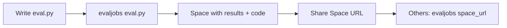

# evaljobs

Run evals on Hugging Face GPUs. Share results and code on Hugging Face Spaces.

## Why evaljobs?

**For eval creators:**
- Write evals in Python using [Inspect AI](https://inspect.aisi.org.uk/)
- Run on HF Jobs (CPU/GPU as needed)
- Results automatically published to a Space
- Share both the eval code and results via a single Space URL

**For eval users:**
- Browse eval results on any Space
- Run the same eval on different models with one command
- Access hundreds of pre-built evals from [inspect_evals](https://github.com/UKGovernmentBEIS/inspect_evals)



## Installation

```bash
pip install git+https://github.com/dvsrepo/evaljobs.git
```

## Usage

### Run pre-built evals from inspect_evals
```bash
evaljobs inspect_evals/arc_easy \
  --model hf/Qwen/Qwen3-0.6B \
  --space username/arc-eval \
  --flavor t4-small
```

### Run your custom eval
```bash
evaljobs my_eval.py \
  --model hf/Qwen/Qwen3-0.6B \
  --space username/my-eval \
  --flavor t4-small
```

For example, running:
```bash
evaljobs examples/midicaps_eval.py --model hf/Qwen/Qwen3-0.6B --space dvilasuero/midicaps_eval_qwen3-0.6 --flavor t4-small --limit 10
```
Evaluates the model with the following code:

```python
"""Inspect eval for MIDI caps benchmark."""
from typing import Any
from inspect_ai import Task, task
from inspect_ai.dataset import Sample, hf_dataset
from inspect_ai.model import ChatMessageUser, ContentText
from inspect_ai.scorer import model_graded_fact
from inspect_ai.solver import generate


@task
def midicaps_eval():
    return Task(
        dataset=hf_dataset(
            path="dvilasuero/midicaps_benchmark",
            split="small_test",
            sample_fields=record_to_sample,
            shuffle=True,
        ),
        solver=generate(),
        scorer=model_graded_fact(
            partial_credit=True,
            model="hf-inference-providers/Qwen/Qwen3-32B:fastest"
        )
    )


def record_to_sample(record: dict[str, Any]) -> Sample:
    message = [
        ChatMessageUser(
            content=[
                ContentText(text=record['caption']),
            ]
        )
    ]
    return Sample(
        input=message,
        target=record["condensed_sequence"]
    )
```

And pushes the eval.py script and the HTML logs to this [space](https://huggingface.co/spaces/dvilasuero/midicaps_eval_qwen3-0.6). 


### Run eval from a Space
```bash
evaljobs https://huggingface.co/spaces/username/eval-name \
  --model hf/Qwen/Qwen3-0.6B \
  --space username/my-results
```
For example, we can run the MidiCaps eval as follows:
```bash
evaljobs https://huggingface.co/spaces/dvilasuero/midicaps_eval_qwen3-0.6 \
  --model hf/Qwen/Qwen3-4B \
  --space dvilasuero/midicaps_eval_qwen3-4B \
  --flavor l4x1    
```

## Options

- `--model`: Model to evaluate (required)
- `--space`: HF Space for results (required)
- `--flavor`: Hardware (default: cpu-basic, options: t4-small, a10g-small, etc.)
- `--timeout`: Job timeout (default: 30m)
- `--limit`: Limit samples for testing

## How it works

1. **Custom evals**: Uploads your eval script to the Space
2. **inspect_evals**: Uses pre-installed package
3. Runs eval on HF Jobs with your chosen hardware
4. Bundles and uploads results to your Space
5. Results viewable at `https://huggingface.co/spaces/username/space-name`

## Examples

- [inspect_evals benchmarks](https://github.com/UKGovernmentBEIS/inspect_evals) - ARC, MMLU, GSM8K, HumanEval, GPQA, etc.
- See `examples/midicaps_eval.py` for a custom eval template
